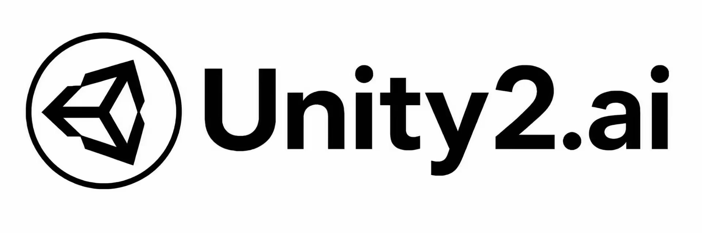

# GPT-Load

[English](README.md) | 中文 | [日本語](README_JP.md)

[](https://github.com/tbphp/gpt-load/releases)

[](LICENSE)

GPT-Load 是一个用 Go 构建的自托管 AI API 网关，用于管理上游密钥，并通过单一服务暴露 OpenAI、Anthropic 与 Gemini 原生端点。

已发布的 1.4.x 维护线文档请访问[官方文档](https://www.gpt-load.com/docs?lang=zh)。

<a href="https://trendshift.io/repositories/14880" target="_blank"></a>
<a href="https://hellogithub.com/repository/tbphp/gpt-load" target="_blank"></a>

## 赞助商

<table>
<tbody>
<tr>
<td width="180"><a href="https://teamorouter.com/?utm_source=gpt_load&utm_medium=referral&utm_campaign=ai_directory"></a></td>
<td>感谢 TeamoRouter 赞助了本项目！TeamoRouter 是企业级 Agentic LLM gateway，让开发者、AI 团队和企业可以通过一个统一 API 访问 Claude Code、Codex、Gemini CLI 和其他 AI agents，无需分别订阅，并可享受最高 90% 的折扣。它连接官方提供商和 OpenAI、Anthropic、Vertex、Azure、AWS Bedrock 等可信合作伙伴，提供经过验证的 Agent protocol 兼容性、请求可追踪性、接近官方的 TTFT、99.6% SLA 以及最高 5,000 QPM。它还包含集中计费、团队管理、BYOK、smart routing、analytics、provider optimization 和专属支持。Teamo Desktop 支持一键设置，无需管理 API key 或手动配置，新用户可通过<a href="https://teamorouter.com/?utm_source=gpt_load&utm_medium=referral&utm_campaign=ai_directory">此链接</a>注册，首充可享 10% 折扣。</td>
</tr>
<tr>
<td width="180"><a href="https://unity2.ai/register?source=gptload"></a></td>
<td>感谢 Unity2.ai 赞助了本项目！Unity2.ai 是面向个人开发者、团队和企业的高性能 AI 模型 API 中转平台，长期服务国内头部企业，日均承载超 300 亿 token 调用，支持 5000 RPM 级高并发。支持余额计费、首充赠额、组合订阅、企业开票和专属对接。通过<a href="https://unity2.ai/register?source=gptload">此链接</a>注册可领取 $2 余额，加入官方群再送 $10 余额，最高可领 $12 免费额度。</td>
</tr>
<tr>
<td width="180"><a href="https://linux.do"></a></td>
<td>非常感谢 LINUX DO 社区的支持！</td>
</tr>
<tr>
<td width="180"><a href="https://www.digitalocean.com/?refcode=3d52cff21342&utm_campaign=Referral_Invite&utm_medium=Referral_Program&utm_source=badge"></a></td>
<td>本项目由 DigitalOcean 支持。</td>
</tr>
</tbody>
</table>

## 开发状态

> [!WARNING]
> 2.0 尚未发布。`v2` 是正在开发的绿地重构分支；需要已维护的 1.4.x 发布线时请使用 `main` 分支。

M1 已作为纯后端里程碑完成，当前不内嵌或提供管理前端；M3 将重新构建该界面。

## 当前 M1 范围

- 提供带 AccessKey 认证的 OpenAI、Anthropic 与 Gemini 原生数据面路由。
- 提供基于 SQLite 的 Group、加密上游密钥、AccessKey 与可重载运行时快照。
- 通过当前管理 API 提供 Group 列表/创建、向现有 Group 导入密钥、两种模型发现操作以及 AccessKey CRUD。
- 未显式提供主密钥时，自动生成本地加密 keyfile。

后续范围明确延后：M2 完善调度与健康行为，M3 扩展控制面并重建管理 UI，M4 增加用量与成本核算。这些能力均不属于 M1。

## 架构与运行边界

- M1 仅交付 Go 后端，并将数据面流量与 `/api` 管理面分离。
- 2.0.0 仅支持 SQLite，且只保证单应用实例的正确性。
- `DATA_DIR` 管理默认 SQLite 数据库和自动生成的 keyfile；`DATABASE_DSN` 与 `ENCRYPTION_KEY` 可分别显式覆盖对应默认值。
- 上游密钥强制静态加密，不允许明文回退。

## 构建与运行

需要 Go 1.25。

```bash
cp .env.example .env
# 启动前在 .env 中设置 AUTH_KEY。
go build -o gpt-load .
./gpt-load
```

开发时使用 race detector：

```bash
make dev
```

## 环境变量

| 变量 | 默认值 | 用途 |
|---|---|---|
| `HOST` | `0.0.0.0` | HTTP 监听地址 |
| `PORT` | `3001` | HTTP 监听端口 |
| `AUTH_KEY` | 必填 | 管理 API bearer token；不能为空且不能包含空白字符 |
| `DATA_DIR` | `./data` | 管理默认数据库与自动生成的 `encryption.key` |
| `DATABASE_DSN` | `${DATA_DIR}/gpt-load.db` | 设置后显式覆盖 SQLite 路径/DSN |
| `ENCRYPTION_KEY` | 自动生成 keyfile | 设置后显式覆盖主密钥 |
| `GRACEFUL_SHUTDOWN_TIMEOUT` | `10` | 优雅停机超时，单位为秒 |
| `READ_TIMEOUT` | `60` | 读取完整请求的最长时间，单位为秒 |
| `IDLE_TIMEOUT` | `120` | keep-alive 空闲超时，单位为秒 |
| `CONTAINER_STOP_GRACE_PERIOD` | `15s` | Docker Compose 停机预算 |
| `LOG_LEVEL` | `info` | 应用日志级别 |
| `LOG_FORMAT` | `text` | 日志格式：`text` 或 `json` |

## 数据面路由

数据面请求使用 AccessKey。按照服务商惯例，可通过 `Authorization: Bearer`、`x-api-key`、`x-goog-api-key` 或 Gemini 的 `key` 查询参数传递凭据。

| 方法 | 路径 | 协议 / 行为 |
|---|---|---|
| `POST` | `/v1/chat/completions` | OpenAI Chat Completions |
| `GET` | `/v1/models` | OpenAI 模型列表；携带 `anthropic-version` 请求头时返回 Anthropic 模型列表格式 |
| `POST` | `/v1/messages` | Anthropic Messages |
| `GET` | `/v1beta/models` | Gemini 模型列表 |
| `POST` | `/v1beta/models/{model}:generateContent` | Gemini 内容生成 |
| `POST` | `/v1beta/models/{model}:streamGenerateContent` | Gemini 流式内容生成 |

Group 由 AccessKey 与运行时配置选择，不作为 URL 路径段传入。

## 管理 API

所有管理路由都要求 `Authorization: Bearer <AUTH_KEY>`。

| 方法 | 路径 | 用途 |
|---|---|---|
| `GET` | `/api/groups` | 列出 Group |
| `POST` | `/api/groups` | 创建 Group |
| `POST` | `/api/groups/{group_id}/keys/import` | 向现有 Group 导入密钥 |
| `POST` | `/api/groups/{group_id}/models/discover` | 通过现有 Group 发现模型 |
| `POST` | `/api/models/discover` | 使用显式上游配置发现模型 |
| `POST` | `/api/access-keys` | 创建 AccessKey |
| `GET` | `/api/access-keys` | 列出 AccessKey |
| `PUT` | `/api/access-keys/{id}` | 更新 AccessKey |
| `DELETE` | `/api/access-keys/{id}` | 删除 AccessKey |

管理面失败响应使用 `{ "code": string, "message": string, "data"?: any }`。仅当客户端需要结构化信息决定下一步动作时才会提供可选的 `data` 字段。

## Docker Compose

Compose 文件默认使用已发布镜像。若要运行尚未发布的 `v2` checkout，请先取消本地 `build` 配置块的注释，然后执行：

```bash
cp .env.example .env
# 启动前在 .env 中设置 AUTH_KEY。
docker compose up -d --build
docker compose logs -f gpt-load
```

升级或修改加密密钥前，必须同时备份 SQLite 数据库和 `${DATA_DIR}/encryption.key`。若设置了 `DATABASE_DSN` 或 `ENCRYPTION_KEY`，则改为备份相应的显式值。

## 测试

```bash
go test -race . ./internal/...
go test ./internal/somepkg -run '^TestName$' -v
```

## 许可证与安全

GPT-Load 使用 [MIT License](LICENSE)。安全漏洞请按 [SECURITY.md](SECURITY.md) 中的流程报告。
